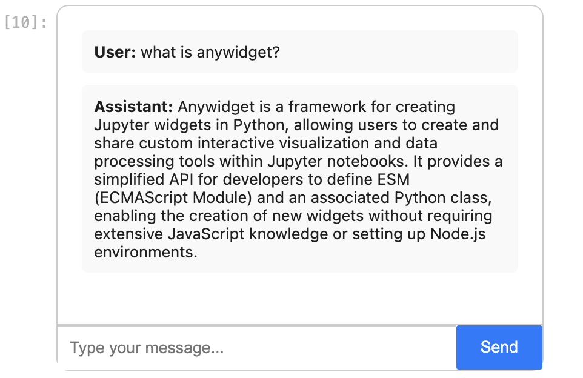

# ipylangchat

A simple [anywidget](https://anywidget.dev) demo that lets you talk to a [LangChain](https://www.langchain.com/) runnable or agent, such as a [conversational RAG](https://python.langchain.com/v0.2/docs/tutorials/rag/), directly in a Jupyter environment (Notebook, Lab, Google Colab, VSCode). No need to serve a web application.

See the [example](./example.ipynb) notebook.


## Installation

```sh
pip install ipylangchat
```

## Usage

Right now, the widget accepts a chain with a prompt template takes in human input as `{input}` and keeps track of chat history through a `{chat_history}` message placeholder. See the langchain [docs](https://python.langchain.com/v0.2/docs/how_to/qa_chat_history_how_to/) and our [example](./example.ipynb) of a conversational RAG on the anywidget documentation.

```python
import ipylangchat

ipylangchat.ChatUIWidget(chain)
```



## Development installation

Create a virtual environment and and install ipylangchat in *editable* mode with the
optional development dependencies:

```sh
python -m venv .venv
source .venv/bin/activate
pip install -e ".[dev]"
```

Open `example.ipynb` in JupyterLab, VS Code, or your favorite editor
to start developing. Changes made in `src/ipylangchat/static/` will be reflected
in the notebook.
